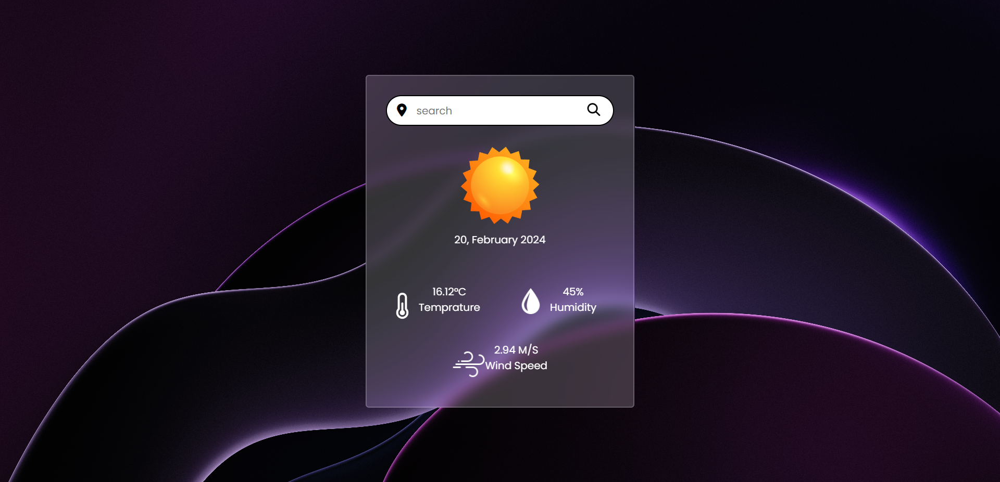

# Weather App



This is a simple and intuitive weather web application built with HTML, CSS, and JavaScript. The app utilizes the OpenWeatherMap API to provide real-time weather information from around the world.

## Live Demo

To see a live demo of this application, click [here](https://withjass19.github.io/Weather-App).

## Features

- Real-time weather information
- Weather information based on city or location
- Additional details such as wind speed, humidity, temperature, etc.
- Beautiful and user-friendly user interface

## Usage

1. Clone or download the repository:

   ```bash
   git clone https://github.com/withjass19/Weather-App.git
2. Open the index.html file in your web browser.

3. Enter the name of a city or location and click the "Search" button.

## Contributing
Contributions are welcome! If you have any suggestions or improvements, please feel free to open a new issue or submit a pull request.

## License
This project is licensed under the MIT License. See the LICENSE file for details.

## Contact
For any assistance or suggestions, feel free to contact me:

### Jaspreet Singh

LinkedIn: [Jaspreet Singh](https://www.linkedin.com/in/jaspreet-s-2227a6226/)
